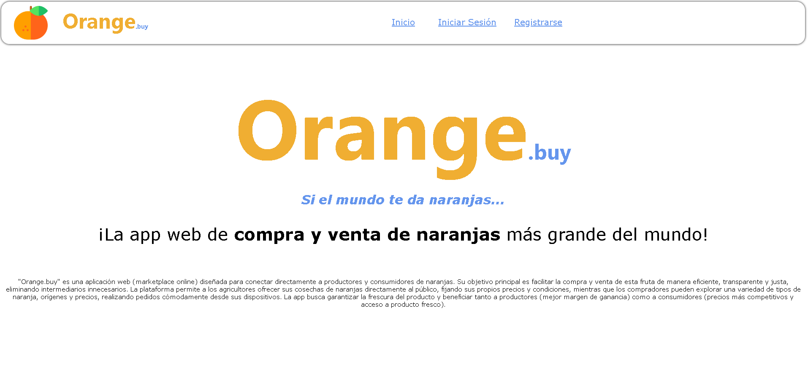
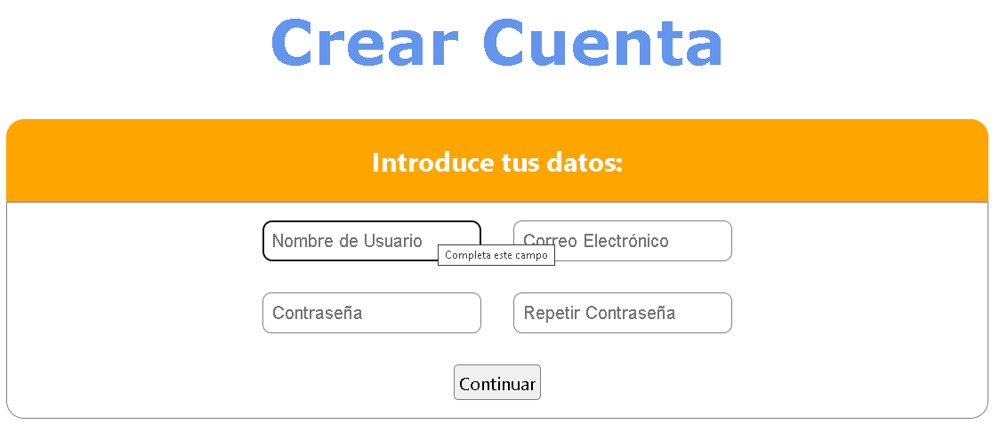
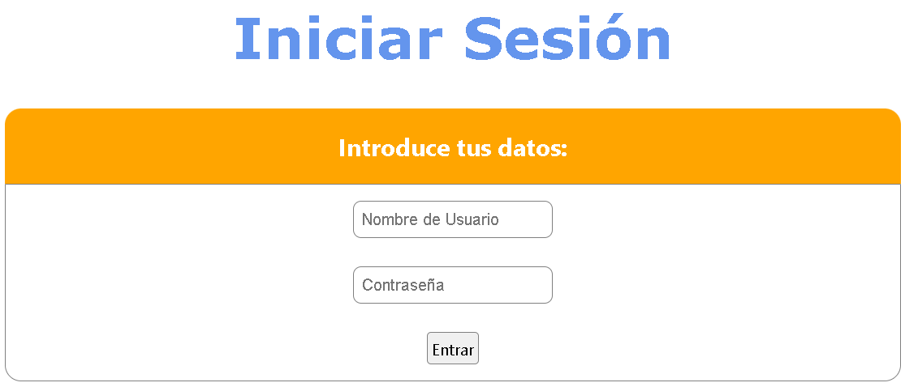

# Orange.buy
Una aplicación web basada en naranjas enfocada en el inicio de sesión y registro de un usuario.

## Tecnologías

  

    
    
Python

  

  

    
    
Django

  

  

    
    
SQLite

  

## RInicio

  

## Crear Cuenta

  

## Iniciar Sesión

  

